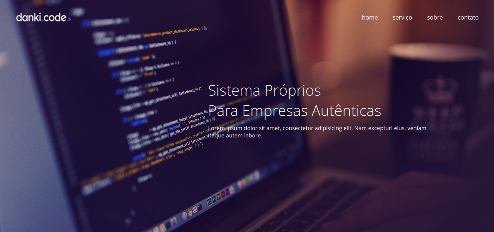
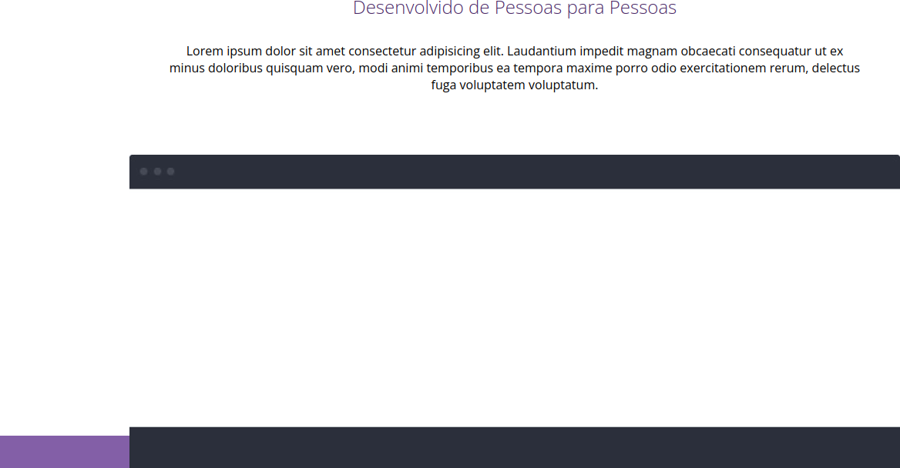
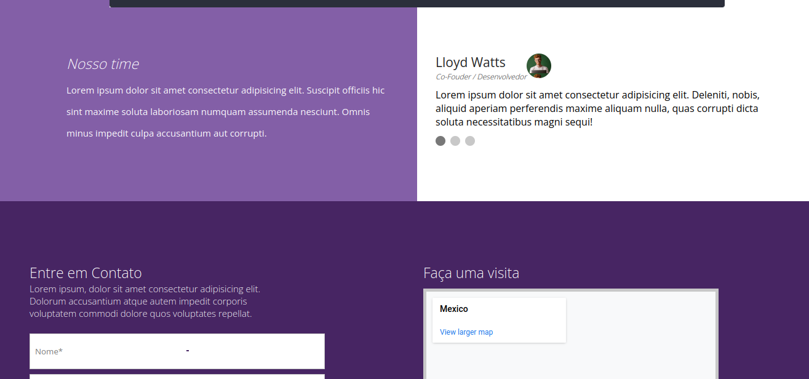
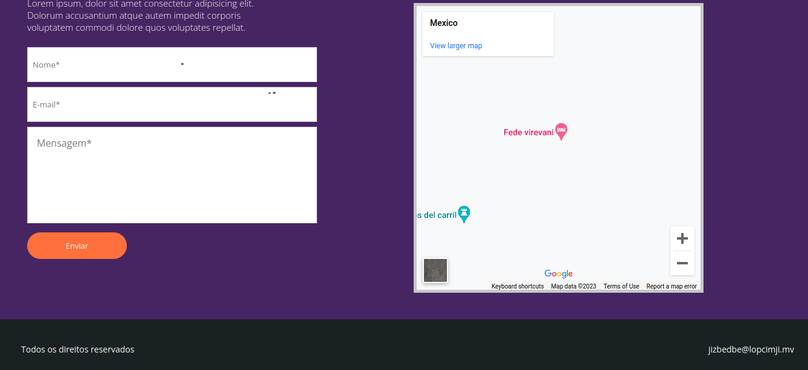

# Site da DankiCode Institucional
## Feito para estudos

### PréVisus:
##### **PréVisu 1**

##### **PréVisu 2**

##### **PréVisu 3**

##### **PréVisu 4**

##### **PréVisu 5**



## Obs: **100% Responsivo**


# HTML:
```
    <!DOCTYPE html>
<html lang="pt-BR">
<head>
    <meta charset="UTF-8">
    <meta name="viewport" content="width=device-width, initial-scale=1.0">
    <meta name="description" content="Minha descrição">
    <meta name="author" content="eu sou criador ou or?">
    <meta name="keywords" content="e,isso,ai">
    <title>Projeto jeto</title>
    <link rel="stylesheet" href="css/style.css">
    <link href="https://fonts.googleapis.com/css?family=Open+Sans:300,400" rel="stylesheet">
    <link rel="stylesheet" href="https://cdn.jsdelivr.net/npm/bootstrap-icons@1.10.5/font/bootstrap-icons.css">
</head>
<body>
    <header>
        <div class="container">
            <div class="logo"></div><!--logo-->
        <nav class="desktop-menu">
            <ul>
                <li><a href="#">home</a></li>
                <li><a href="#">serviço</a></li>
                <li><a href="#">sobre</a></li>
                <li><a href="#">contato</a></li>
            </ul>
        </nav>

        <nav class="mobile-menu">
            <i class="bi bi-list"></i>
            <ul>
                <li><a href="#">home</a></li>
                <li><a href="#">serviço</a></li>
                <li><a href="#">sobre</a></li>
                <li><a href="#">contato</a></li>
            </ul>
        </nav>

        <div class="clear"></div><!--clear-->

        <div class="chamada1">
            <h2>Sistema Próprios<br>
             Para Empresas Autênticas</h2>
             <p>Lorem ipsum dolor sit amet, consectetur adipisicing elit. Nam excepturi eius, veniam itaque autem labore.</p>
        </div><!--chamada-->
    </div><!--container-->
    </header>

    <section class="sessao1">
        <div class="container">
            <div class="texto-sessao1">
                <h2>Desenvolvemos Sistemas Únicos</h2>
                <p>Lorem ipsum dolor sit amet.</p>
                <ul>
                    <li>Sites</li>
                    <li>Lojas Virtuais</li>
                    <li>Sistemas</li>
                </ul>
        <div class="clear"></div><!--clear-->
                <div class="btn1-texto">Entre em Contato</div><!--btn-texto-->
            </div><!--texto-sessao1-->
            <div class="device-sessao1">

            </div><!--device-sessao1-->
        <div class="clear"></div><!--clear-->
        </div><!--container-->
    </section><!--sessao1-->

    <section class="sessao2">
        <div class="container">
            <h2>Desenvolvido de Pessoas para Pessoas</h2>
            <p>Lorem ipsum dolor sit amet consectetur adipisicing elit. Laudantium impedit magnam obcaecati consequatur ut ex minus doloribus quisquam vero, modi animi temporibus ea tempora maxime porro odio exercitationem rerum, delectus fuga voluptatem voluptatum.</p>
            
        </div><!--container-->
    </section><!--sessao2-->

    <section class="sessao3">
        <div class="part1">
            <div class="wraper-part1">
            <h2>Nosso time</h2>
            <p>Lorem ipsum dolor sit amet consectetur adipisicing elit. Suscipit officiis hic sint maxime soluta laboriosam numquam assumenda nesciunt. Omnis minus impedit culpa accusantium aut corrupti.</p>
        </div><!--wraper-part1-->
        </div><!--part1-->
        <div class="part2">
            <div class="sobre-autor">
                <div class="titulo-autor">
                    <div class="wraper-titulo-autor">
                <h2>Lloyd Watts</h2>
                <p>Co-Fouder / Desenvolvedor</p>
            </div><!--wraper-titulo-autor-->
                <div class="img-autor"></div><!--img-autor-->
            </div><!--titulo-autor-->
            <div class="texto-autor">
                <p>Lorem ipsum dolor sit amet consectetur adipisicing elit. Deleniti, nobis, aliquid aperiam perferendis maxime aliquam nulla, quas corrupti dicta soluta necessitatibus magni sequi!</p>
            </div><!--texto-autor-->
            </div><!--sobre-autor-->
            <div class="slider-bullets">
                <span></span>
                <span></span>
                <span></span>
            </div><!--slider-bullets-->
        </div><!--part2-->
        <div class="clear"></div><!--clear-->
    </section><!--sessao3-->

    <section class="sessao4">

        <div class="container">
            <div class="form">
                <h2>Entre em Contato</h2>
                <p>Lorem ipsum, dolor sit amet consectetur adipisicing elit. Dolorum accusantium atque autem impedit corporis voluptatem commodi dolore quos voluptates repellat.</p>
                <form action="">
                    <input type="text" name="name" id="name" placeholder="Nome*">
                    <input type="email" name="email" id="email" placeholder="E-mail*">
                    <textarea name="mensagem" id="mensagem" cols="30" rows="10" placeholder="Mensagem*"></textarea>
                    <div class="clear"></div><!--clear-->
                    <div><input type="submit" value="Enviar"></div>
                </form>
            </div><!--form-->
            <div class="map-wraper">
                <h2>Faça uma visita</h2>
                <div class="map-wraper3">
                <div class="map-wraper2">
                    <iframe class="map" src="https://maps.google.com/maps?q=mexico&t=&z=17&ie=UTF8&iwloc=&output=embed"></iframe>
        </div><!--map-wraper2-->
    </div><!--map-wraper3-->
        </div><!--map-wraper-->
        <div class="clear"></div><!--clear-->
        </div><!--container-->
    </section><!--sessao4-->

    <footer>
        <div class="container">
        <p>Todos os direitos reservados</p>
        <p>jizbedbe@lopcimji.mv</p>
        <div class="clear"></div><!--clear-->
    </div><!--container-->
    </footer>

</body>
</html>
```
# CSS:
```
    *{
    padding: 0;
    margin: 0;
    box-sizing: border-box;
    font-weight: normal;
    font-family: "Open Sans",sans-serif;
    resize: none;
}
html,body{
    height: 100%;
}
.clear{clear: both;}

header{
    width: 100%;
    height: 90vh;
    min-height: 800px;
    padding: 40px 2%;
    background-size: cover;
    background-position: center;
    background-image: url("../img/capa.png");
    font-weight: 300;
}
nav.mobile-menu{
    cursor: pointer;
    display: none;
    font-size: 32px;
    color: #FFFFFF;
}
nav.mobile-menu ul{
    opacity: 0;
    transition: 0.3s;
    background-color: #FFFFFF;
    position: absolute;
    width: 100%;
    left: 0;
    top: 90px;
    list-style-type: none;
    text-align: center;
}
nav.mobile-menu:hover ul{
    opacity: 1;
}
nav.mobile-menu ul li:hover{
    background-color: rgb(230,230,230);
}
nav.mobile-menu ul li{
    transition: 0.3s;
    border-bottom: 1px solid #000000;
    padding: 8px 0;
}
nav.mobile-menu ul li a{
    text-decoration: none;
    color: #000000;
}
header nav{
    float: right;    
}
.container{
    max-width: 1280px;
    margin: 0 auto;
}
header nav.desktop-menu li{
    margin: 0 20px;
    float: left;
}
header nav.desktop-menu ul{
    list-style: none;
}
header nav.desktop-menu li a{
    text-decoration: none;
    color: #FFFFFF;
}
header .logo{
    width: 160px;
    height: 40px;
    position: relative;
    top: -10px;
    float: left;
    background-repeat: no-repeat;
    background-position: center;
    background-size: contain;
    background-image: url("../img/logo.png");
}
.chamada1{
    float: right;
    max-width: 600px;
    margin: 140px 150px;
}
.chamada1 h2{
    font-size: 40px;
    color: #FFFFFF;
    font-weight: 300;
}
.chamada1 p{
    font-size: 15px;
    color: #FFFFFF;
    margin-top: 10px;
}

section.sessao1{
    width: 100%;
    background-color: #472562;
    padding: 0 2%;
    height: 400px;
}
section.sessao1 .container{
    max-width: 1000px;
    height: calc(100% + 30px);
}
.texto-sessao1{
    float: left;
    margin-top: 60px;
    padding-left: 80px;
    width: 50%;
    color: #FFFFFF;
    position: relative;
    left: 55px;
}
.texto-sessao1 h2{
    font-size: 26px;
    font-weight: 300;
}
.texto-sessao1 p{
    font-size: 15px;
    margin-top: 20px;
}
.texto-sessao1 ul{
    font-size: 15px;
    list-style-position: inside;
}
.texto-sessao1 ul li{
    float: left;
    width: 100%;
    margin-top: 8px;
}
.device-sessao1{
    float: left;
    width: 50%;
    height: 430px;
    background-image: url("../img/device.png");
    background-repeat: no-repeat;
    background-size: 100% 100%;
    position: relative;
    top: -30px;
}
.btn1-texto{
    background-color: #FF703d;
    width: 165px;
    height: 44px;
    color: #FFFFFF;
    cursor: pointer;
    margin-top: 10px;
    text-align: center;
    line-height: 44px;
    border-radius: 30px;
    font-size: 13px;
    margin-top: 16px;
}
.sessao2{
    padding-left: 2%;
    padding-right: 2%;
    background-color: #FFFFFF;
    text-align: center;
}
.sessao2 h2{
    color: #472663;
    font-weight: 300;
}
.sessao2 p{
    margin-top: 30px;
    max-width: 900px;
    display: inline-block;
}
.sessao2 img{
    width: 100%;
    position: relative;
    top: 70px;
    margin-top: 10px;
}
.sessao2 .container{
    max-width: 1000px;
}
.sessao3{
    width: 100%;
}
.part1{
    color: #FFFFFF;
    float: left;
    width: 50%;
    height: 380px;
    padding: 140px 0 90px 0;
    background-color: #835FA7;
}
.part1 h2{
    font-weight: 300;
    font-style: italic;
    font-size: 23px;
}
.part1 p{
    font-size: 15px;
    line-height: 35px;/*ESPAÇAMENTO ENTRE AS LINHAS*/
    margin-top: 10px;
}
.wraper-part1{
    max-width: 600px;
    float: right;
    padding: 0 30px;
}
.part2{
    float: left;
    width: 50%;
    padding: 140px 0 90px 0;
}
.sobre-autor{
    float: left;
    max-width: 600px;
    padding-left: 30px;
}
.titulo-autor{
    float: left;
    width: 100%;
}
.titulo-autor h2{
    color: #232323;
    font-weight: 400;
    font-size: 21px;
    padding-right: 20px;
}
.titulo-autor p{
    font-size: 12px;
    color: #232323;
    font-style: italic;
    font-weight: 300;
}
.titulo-autor .img-autor{
    float: left;
    width: 40px;
    height: 40px;
    border-radius: 20px;
   background-image: url("../img/profile.jpg");
}
.wraper-titulo-autor{
    float: left;   
}
.texto-autor{
    float: left;
    width: 100%; 
    margin-top: 10px;   
}
.slider-bullets{
    float: left;
    padding-left: 30px;
    margin-top: 12px;
    width: 100%;
}
.slider-bullets span{
    width: 16px;
    height: 16px;
    float: left;
    margin-right: 8px;
    cursor: pointer;
    background-color: rgb(200,200,200);
    border-radius: 8px;
}
.slider-bullets span:nth-of-type(1){
    background-color: rgb(120,120,120);
}
section.sessao4{
    background-color: #472563;
    padding: 100px 0;
}
.form{
    float: left;
    width: 50%;
    color: #FFFFFF;
    padding-left: 10px;
}
.form h2{
    font-size: 23px;
    font-weight: 300;
}
.form p{
    font-size: 15px;
    font-weight: 300;
    max-width: 400px;
    padding-right: 10px;
}
.form form{
    margin-top: 15px;
}
.form form input[type="text"],
.form form input[type="email"]{
    width: 90%;
    max-width: 480px;
    height: 58px;
    padding-left: 8px;
    line-height: 58px;
    border: 1px solid rgb(200,200,200);
    margin-top: 8px;
}
.form form textarea{
    width: 90%;
    max-width: 480px;
    padding: 15px;
    border: 1px solid rgb(200,200,200);
    height: 160px;
    margin-top: 8px;
}
.form form input[type="submit"]{
    background-color: #FF703d;
    width: 165px;
    height: 44px;
    color: #FFFFFF;
    cursor: pointer;
    margin-top: 10px;
    border-radius: 30px;
    font-size: 13px;
    margin-top: 15px;
    border: none;
}

.map-wraper{
    float: left;
    width: 50%;
    color: #FFFFFF;
    padding: 0 10px;
}
.map-wraper h2{
    font-size: 23px;
    font-weight: 300;
}
.map-wraper2{
    position: absolute;
    left: 0;
    top: 0;
    width: 100%;
    padding-top: 100%;
}
.map-wraper3{
    margin-top: 10px;
    width: 100%;
    float: left;
    max-width: 480px;
    position: relative;
}
.map-wraper .map{
    position: absolute;
    width: 100%;
    left: 0;
    top: 0;
    height: 100%;
    background-color: #FFFFFF;
    border: 5px solid rgb(200,200,200);
}
footer{
    padding: 40px 2%;
    background-color: #192123;
    color: #FFFFFF;
    font-size: 14px;
}
footer p:nth-of-type(1){
    float: left;
}
footer p:nth-of-type(2){
    float: right;
}


@media screen and (max-width: 768px){
    header{
        width: 100%;
        height: auto;
        padding: 40px 2%;
    }
    nav.desktop-menu{
         display: none;        
    }
    nav.mobile-menu{
        display: block;
    }
    .chamada1{
        float: none;
        text-align: center;
        width: 100%;
        max-width: none;
        margin: 100px 0;
    }
    .chamada1 h2{
        font-size: 30px;
        padding: 0 10px;
        color: #FFFFFF;
        font-weight: 300;
    }
    .chamada1 p{
        font-size: 15px;
        color: #FFFFFF;
        margin-top: 10px;
    }
    section.sessao1{
        padding: 40px 2%;
        height: auto;
        text-align: center;
    }
    .texto-sessao1{
        width: 100%;
        display: inline-block;
        float: none;
        margin-top: 0;
        padding-left: 0;
        position: static;
    }
    .btn1-texto{
        display: inline-block;
    }
    .texto-sessao1 ul{
        display: inline-block;
        margin-top: 20px;
    }
    .texto-sessao1 ul li{
        float: none;
        text-align: left;
    }
    .device-sessao1{
        display: none;
    }
    .sessao2{
        padding-top: 40px;
    }
    section.sessao4 .container{
        text-align: center;
    }
    .form{
        float: none;
        width: 100%;
    }
    .form p{
        display: inline-block;        
    }
    .map-wraper{
        float: none;
        width: 100%;
        padding: 0 4%;
        margin-top: 40px;
    }
    .map-wraper2{
        position: absolute;
        left: 0;
        top: 0;
        width: 100%;
        height: 100%;
    }
    .map-wraper3{
        margin-top: 10px;
        width: 80%;
        padding-top: 80%;
        float: none;
        display: inline-block;
        position: relative;
    }
}
@media screen and (max-width: 830px){
    .chamada1{
        float: none;
        text-align: center;
        width: 100%;
        max-width: none;
        margin: 170px 0;
    }
    .chamada1 h2{
        font-size: 30px;
        padding: 0 10px;
        color: #FFFFFF;
        font-weight: 300;
    }
    .chamada1 p{
        font-size: 15px;
        color: #FFFFFF;
        margin-top: 10px;
    }
    .sessao2{
    padding: 40px 2%;        
    }
}
@media screen and (max-width: 568px){
    .part1{
        width: 100%;
        height: auto;
        padding: 40px 0;
    }
    .part2{
        width: 100%;
        padding: 40px 0;
    }
    .sessao2 img{
        top: 16px;
        margin-top: 20px;
    }
    footer{
        text-align: center;
    }
    footer p:nth-of-type(1){
        float: none;
    }
    footer p:nth-of-type(2){
        float: none;
        margin-top: 8px;
    }
}

```